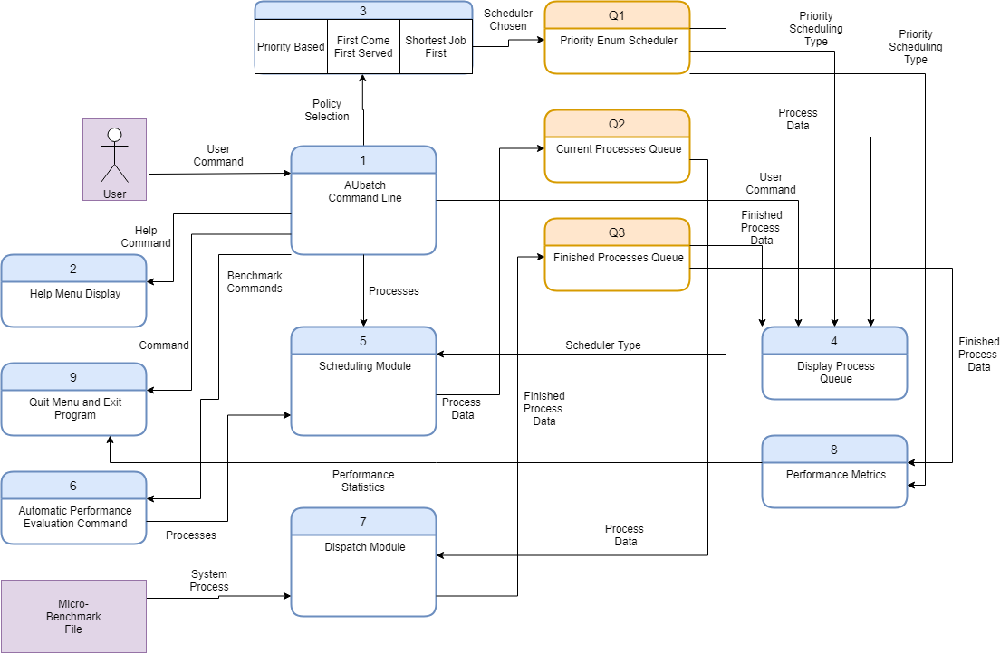

# AUbatch — a pthread-based batch-job scheduler

An interactive batch scheduling system, ~1,300 lines of C. Jobs are
submitted at a prompt, queued by a scheduling thread, and executed by a
dispatching thread; three scheduling policies can be swapped live and
compared with built-in benchmarks. COMP 7500 Project 3 (March 2021).

## How it works

Two threads share a bounded circular job queue guarded by one mutex and a
pair of condition variables (`cmd_buf_not_full` / `cmd_buf_not_empty`):

- **Command thread** ([commandline.c](commandline.c)) — a REPL that parses
  input through a dispatch table and hands submitted jobs to `scheduler()`,
  which enqueues them and re-sorts the pending window by the active policy.
- **Dispatcher thread** ([schedule.c](schedule.c)) — blocks on the condition
  variable until jobs arrive, dequeues the head, `fork()`s and `execv()`s
  the job's program, waits for it, and records per-job timing.

The three policies are a single `qsort` comparator (`switch_to_policy()`):
FCFS compares arrival time, SJF remaining CPU time, priority the priority
level. Switching policy re-sorts the queue in place.



## Commands

| Command | Effect |
|---|---|
| `run <job> <time> <pri>` | submit `<job>` with an expected CPU time and priority |
| `list` | show queued and running jobs |
| `fcfs` / `sjf` / `priority` | switch scheduling policy and reschedule the queue |
| `test <name> <policy> <njobs> <arrival> <prilevels> <mincpu> <maxcpu>` | generate a synthetic workload, run it, and print metrics |
| `quit` | wait for the queue to drain, print metrics, exit (`quit -i` exits immediately) |

After a workload completes, AUbatch reports average turnaround, CPU,
waiting, and response times plus throughput.

## Build and run

```
make
gcc -o micro micro.c      # the synthetic benchmark job
./aubatch
```

`micro <seconds>` occupies the CPU for the requested time (the parent
spins while a forked child sleeps), and `test` submits it in bulk. A
captured session is in [docs/sample-session.script](docs/sample-session.script);
benchmark runs across workload mixes are in the
[project report](docs/project-report.pdf).

## Provenance

The command parser — the dispatch table, `cmd_dispatch()`, and the REPL
loop — began from Dr. Xiao Qin's OS/161-derived sample code, as the 2021
file headers note. The scheduler and dispatcher modules, the policy
sorting, the metrics, the benchmark mode, and the extended command set are
mine. Two fixes since submission: the shared globals are declared
`extern` so the program links under GCC 10 and newer, and `quit` no
longer reads an argument that was never typed (`quit -i` now really does
skip the queue drain and exit immediately).
