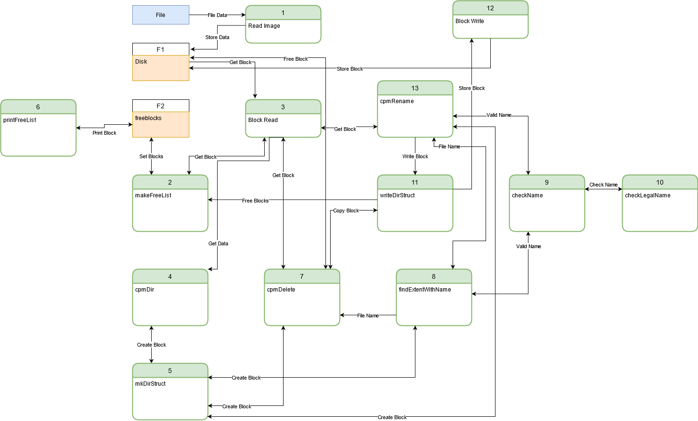

# cpmFS — a CP/M-style file system

A simple file system in the style of CP/M, implemented over an in-memory
disk-image simulator: a 256 KB disk of 256 × 1 KB blocks, with a single
directory block of 32-byte extents. ~500 lines of C.
COMP 7500 Project 4 (April 2021).

## On-disk layout

Block 0 is the directory: 32 extents of 32 bytes, one file per extent.

| Bytes | Field |
|---|---|
| 0 | status (`0xe5` = unused entry) |
| 1–8 | file name, space-padded |
| 9–11 | extension (8.3 names) |
| 12–15 | size bookkeeping: XL, BC (bytes in last sector), XH, RC (128-byte sectors in last block) |
| 16–31 | data-block numbers (0 = unused slot) |

[cpmfsys.c](cpmfsys.c) implements extent parsing and serialization
(`mkDirStruct` / `writeDirStruct`), free-block-list construction from the
directory (`makeFreeList` / `printFreeList`), directory listing with exact
file sizes computed from RC and BC (`cpmDir`), 8.3 name validation, name
lookup, rename, and delete. The byte-level file API (`cpmRead`/`cpmWrite`,
open/close) was explicitly out of the assignment's scope and is not
implemented.



## Build and run

```
make
./cpmRun
```

The driver loads [image1.img](image1.img) — the course-provided 256 KB
test image, kept here as a fixture — lists the directory, deletes and
renames files, and prints the free-block map after each step. All writes
go to the in-memory copy, so the image file itself is never modified.
Reference output is in [docs/sample-output.txt](docs/sample-output.txt).

## Provenance

`diskSimulator.c/.h` (the block-device simulator), `fsysdriver.c` (the
test driver), and the `cpmfsys.h` interface spec are Dr. Xiao Qin's course
handouts, unmodified apart from commenting out the prototypes the
assignment marked optional. `cpmfsys.c` — the entire file-system
implementation — is mine. One fix since submission: `makeFreeList`
cleared `BLOCK_SIZE` entries of the `NUM_BLOCKS`-long free list,
overrunning the array; it now clears exactly `NUM_BLOCKS`.
